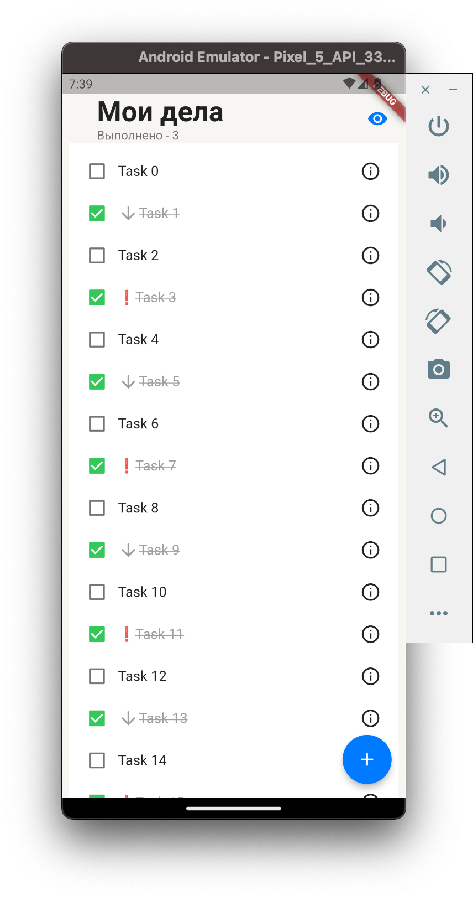
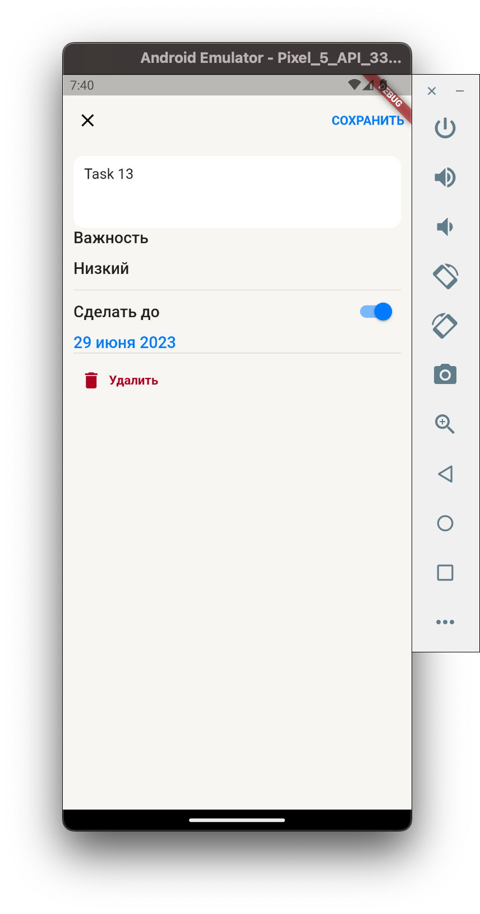

# todo_app

Flutter app to manage your todos.

# README

For review use this merge requsts. But, README is up to date in master branch
Most of V3 features done in [V2](https://github.com/Demezy/todo_app/pull/5), [V2.1](https://github.com/Demezy/todo_app/pull/6) MRs

## APK
v3 - [link](https://github.com/Demezy/todo_app/releases/download/release_v2.1/app-release.apk)

## Stack

- riverpod
- flutter_hooks
- freezed

## Features
- add tasks
- hide done tasks
- swipes
  - animation
  - open menu via short swipe
  - perform action via long swipe
- clean architecture!
- app icon
- offline first
- syncronization when awailable

## UI remark
- green button - force sync (naturally going in background)
- red button - delete all entries
- swipe mechanics
  - long to apply action
  - short to open menu (delete menu intentionnaly keeped to quickly delete many entries)

## V1 Gallery 

## Download links
[V1 app](https://github.com/Demezy/todo_app/releases/download/untagged-3ce9b9b2c5f4b54647ff/app-release.apk)

